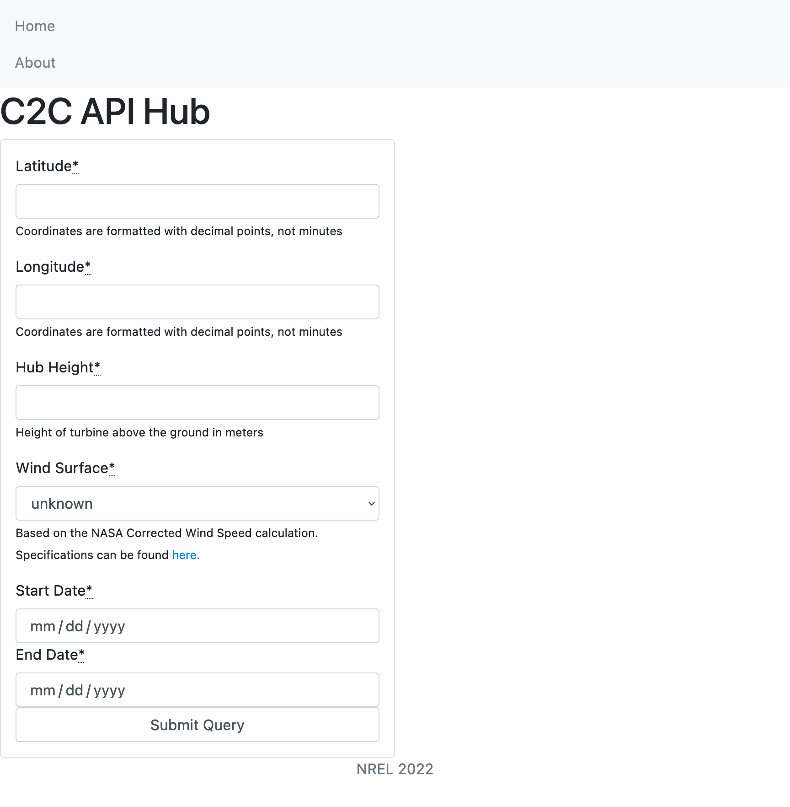

# Communities to Clean API Hub

---

## Description

A data aggregation platform that combines various data sources to aid in the development of renewable energy. This project is specifically meant to assist local community leaders in making decisions without expensive siting and consultation.



* **Technology Stack**: This is a web app/api primarily written in nodejs. HTML/EJS are used for the front-end

* **Status**: This project is in an incredibly preliminary phase. This repository is mostly for organization and internal presentation, **not for community use**

* **Instances**: Demo is currently not hosted

* **Project Purpose**: Although the data that is presented here can also be found in the APIs that this project accesses, this is meant to act as a simplified middle layer that greatly speeds up the process for renewable energy specific applications
  
## Dependencies

* Docker
* nodejs
  * For specific packages check the package.json
* API keys/developer accounts

## Installation

To install the project, simply clone this repository to your computer. If git is installed, navigate to the directory you wish to clone it to and execute this command:

```bash
git clone https://github.com/filip-r-casey/C2C-API-HUB
```

## Usage

First ensure that docker is installed on your machine. Then open a terminal window in the project directory

```bash
docker compose build
docker compose up
```

This will start the container that runs the web application. To access the app, navigate to [PORT 3000](http://0.0.0.0:3000/)

In order for the APIs to be accessed properly, many of them require developer keys. For privacy reasons, personal developer keys **should not** be included in this repository. Links to get your own API keys are here:

* [NASA POWER](https://api.nasa.gov/)
* [Wind Toolkit](https://developer.nrel.gov/signup/)
* [Open Weather](https://openweathermap.org/appid)

In order for the application to use these keys, you must create a `.env` file in the application root directory. Follow this template for it to work properly:

```txt
NASA_POWER_API_KEY="{API_KEY}"
WIND_TOOLKIT_API_KEY="{API_KEY}"
OPEN_WEATHER_API_KEY="{API_KEY}"
EMAIL="{EMAIL}"
```

## Testing

Tests not currently included but will be added in the future

## Known Issues

* Wind Toolkit API cannot return a JSON file for data larger than a couple of megabytes, so a download link is provided as a substitute

## Data sources

This app sources information from the following APIS:

* [NASA POWER](https://power.larc.nasa.gov/docs/services/api/)
* [Wind Toolkit](https://www.nrel.gov/grid/wind-toolkit.html)
* [TAP](https://dw-tap.nrel.gov/#api-Wind_Speed)
* [Open Weather](https://openweathermap.org/api)
* [National Weather Service](https://www.weather.gov/documentation/services-web-api#/default/station_observation_list)
* [NCEI](https://www.ncei.noaa.gov/support/access-data-service-api-user-documentation)
  
A report on the types of information available from these sources and the assumptions that they make is in progress

## Getting Help

Currently, extensive documentation is not available. If your question is not answered here email: filip.r.casey@gmail.com
